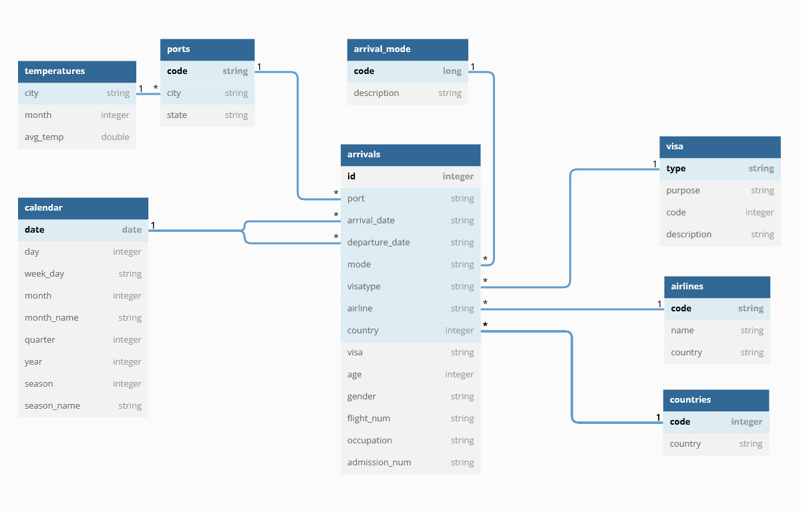

### Udacity Data Engineering Capstone Project
# US Immigration and Tourism Data

#### Project Summary
The purpose of this project is to analyze US immigration and tourism data. To achieve this goal, the data is extracted from different datasets and transformed to work in a star schema. This schema is then ready to be used to observe trends and behaviors in the data over time.

The project was developed according to the following steps:
* [Step 1: Scope the Project and Gather Data](#step1)
* [Step 2: Explore and Assess the Data](#step2)
* [Step 3: Define the Data Model](#step3)
* [Step 4: Run ETL to Model the Data](#step4)
* [Step 5: Complete Project Write Up](#step5)
* [Step 6: Data Analysis Demo over the processed tables](#step6)

```python
# Do all imports and installs here
import pandas as pd
import datetime
from pyspark.sql import SparkSession
from pyspark.sql.types import DateType, StructType, StructField, IntegerType, StringType, FloatType

spark = SparkSession \
    .builder \
    .config('spark.jars.packages', 'org.apache.hadoop:hadoop-aws:2.7.0') \
    .master('local[*]') \
    .config('spark.executor.memory', '12g') \
    .config('spark.driver.memory', '12g') \
    .config('spark.memory.offHeap.enabled', True) \
    .config('spark.memory.offHeap.size', '12g') \
    .config('spark.sql.shuffle.partitions', 64) \
    .getOrCreate()
```

<a id='step1'></a>
### Step 1: Scope the Project and Gather Data

#### Scope 
- Explain what you plan to do in the project in more detail:
    - Import data from US Immigration Data, Airlines and Global Temperature datasets
    - Load the data into pySpark dataframes to transform the data accordingly
    - Create a star schema and populate the fact and dimensions with data from the datasets
    - Store the data in parquet files that can be used in a Data Warehouse for data analysis purposes
- What data do you use?
    - I94 US Immigration Data - 2016
    - World Airports Data
    - World Tempearture Data
- What is your end solution look like?
    - Tables stored in a star schema built to perform data analysis on immigration data in the US
- What tools did you use?
    - Python 3.8 (dependencies listed in requirements.txt)
    - Pyspark 3.3.0 (Scala version 2.12.15)
    - OpenJDK 64-Bit Server VM (build 11.0.15+10-Ubuntu-0ubuntu0.20.04.1, mixed mode, sharing)
#### Describe and Gather Data 
Describe the data sets you're using. Where did it come from? What type of information is included? 
#### I94 Immigration Data

This data was provided by the US National Tourism and Trade Office and contains statistics of visitor arrival during 2016.

The original dataset is in SAS7BDAT format and can be found [here](https://www.trade.gov/
national-travel-and-tourism-office)
```python
# Read in the data here
immigration_df = spark.read.parquet('data/i94-sample')
```
#### World Temperature Data
This dataset was obtained from Kaggle and it explores global temperatures since 1750.

The original dataset (in CSV format) can be found [here](https://www.kaggle.com/datasets/berkeleyearth/climate-change-earth-surface-temperature-data). The file was converted to parquet as the .parquet file is smaller in size.
```python
# temperature data
temperature_df = spark.read.parquet('data/GlobalLandTemperaturesByCity.parquet')
```
#### Port of Entry
This dataset contains the 3 letter codes used by Customs and Border Protection to indicate ports-of-entry and is used in the i94 immigration data (i94 port field). It is a combination of data obtained [here](https://fam.state.gov/fam/09FAM/09FAM010205.html) and in file I94_SAS_Labels_Descriptions.SAS (available in Udacity's capstone project template)
```python
ports_of_entry_df = spark.read.options(
    header=True, inferSchema=True, delimiter=';'
).csv('data/port_of_entry_codes.csv')
```
### Country Codes
This dataset contains country codes used in i94 forms and their respective names. It was also obtained from I94_SAS_Labels_Descriptions.SAS (available in Udacity's capstone project template)
```python
country_codes_df = spark.read.options(
    header=True, inferSchema=True, delimiter=';'
).csv('data/country_codes.csv')
```
#### Visa Types
This dataset contains types of visa obtained from the Department of State - Bureau of Consular Affairs. The information used to build this dataset can be found [here](https://travel.state.gov/content/travel/en/us-visas/visa-information-resources/all-visa-categories.html)
```python
visa_types_df = spark.read.options(
    header=True, inferSchema=True, delimiter=','
).csv('data/visa_types.csv')
```
#### Airlines
This dataset contains information about almost six thousand airlines and can be found on [Kaggle](https://www.kaggle.com/datasets/open-flights/airline-database)
```python
airlines_df = spark.read.options(
    header=True, inferSchema=True, delimiter=','
).csv('data/airlines.csv')
```

<a id='step2'></a>
### Step 2: Explore and Assess the Data
#### Explore the Data 
Identify data quality issues, like missing values, duplicate data, etc.

Below are some SQL commands executed to explore the datasets used in this project.

```python
# creating views to explore the data
immigration_df.createOrReplaceTempView('immigration_data')
country_codes_df.createOrReplaceTempView('country_codes')
airlines_df.createOrReplaceTempView('airlines')
ports_of_entry_df.createOrReplaceTempView('ports')
visa_types_df.createOrReplaceTempView('visa')

epoch = datetime.datetime(1960, 1, 1).date()
spark.udf.register(
    'isoformat',
    lambda x: (epoch + datetime.timedelta(x)).isoformat() if x else None)
# querying the data using spark
# joining i94 data with the other datasets
# filtering out invalid and missing data
spark.sql('''
    SELECT INT(i.cicid) AS id,
           i.i94port AS port,
           i.arrdate AS arrival_date,
           i.depdate AS departure_date,
           SPLIT(p.location, ',')[0] AS port_city,
           SPLIT(p.location, ',')[1] AS port_state,
           i.visatype,
           v.purpose,
           cc.country,
           i.airline,
           a.name AS airline_name,
           i.gender,
           INT(i.i94bir) AS age
    FROM immigration_data i
    JOIN country_codes cc ON INT(i.i94res) = cc.code
    JOIN airlines a ON i.airline = a.IATA
    JOIN ports p ON p.code = i.i94port
    LEFT JOIN visa v ON v.type = i.visatype
    WHERE cc.country NOT LIKE 'INVALID:%'
    AND cc.country NOT LIKE 'No Country Code%'
    AND i.gender IS NOT NULL
    LIMIT 10
''').toPandas()
```

```python
# most common visa types
spark.sql('''
    SELECT i.visatype, count(*)
    FROM immigration_data i
    GROUP BY i.visatype
    ORDER BY 2 DESC
''').toPandas()
```
```python
# counting the number of distinct ports in immigration data
spark.sql('''
    SELECT DISTINCT i94port
    FROM immigration_data
''').count()
```
```python
# checking how many of these ports exist in port of entry codes
spark.sql('''
    SELECT code
    FROM ports
    WHERE code IN (SELECT DISTINCT i94port
                   FROM immigration_data)
''').count()
```

#### Cleaning Steps
Steps necessary to clean the data
```python
# Performing cleaning tasks
# Immigration data
def clean_immigration_data(
    immigration_df,
    country_codes_df,
    remove_cols=None,
    drop_duplicates=False
):
    '''
    Clean Immigration data by removing invalid and not given country codes
    Args:
        remove_cols (list): list of columns to remove from the dataframe
        drop_duplicates (bool): allow dropping duplicate records
    Returns:
        Immigration data dataframe
    '''

    immigration_df.createOrReplaceTempView('immigration_data')
    country_codes_df.createOrReplaceTempView('country_codes')

    pre_clean_rows = immigration_df.count()
    print(f'row count: {pre_clean_rows}')

    immigration_df = spark.sql('''
        SELECT i.*, INT(i.i94res) AS country
        FROM immigration_data i
        JOIN country_codes cc ON INT(i.i94res) = cc.code
        WHERE cc.country NOT LIKE 'INVALID:%'
        AND cc.country NOT LIKE 'No Country Code%'
    ''')

    rows_removed = immigration_df.count() - pre_clean_rows

    print(f'{rows_removed} rows removed')

    if drop_duplicates:
        # Removing duplicate records
        immigration_df.dropDuplicates()

    # removing unnecessary columns
    if remove_cols:
        immigration_df = immigration_df.drop(*remove_cols)

    print(f'row count: {immigration_df.count()}')

    return immigration_df

```
```python
cols = [
    'biryear', 'count', 'dtaddto', 'dtadfile',
    'entdepa', 'entdepd', 'entdepu',
    'i94yr', 'i94mon', 'i94cit', 'i94addr', 'i94res',
    'matflag', 'visapost',
]

# calling the method to remove duplicates and drop unnecessary columns
immigration_df = clean_immigration_data(
    immigration_df, country_codes_df,
    remove_cols=cols, drop_duplicates=True)

immigration_df.show(n=5)

def transform_immigration_data(df):
    '''
    renames columns, cast data types and formats values in immigration_data
    Args:
        df (object): spark dataframe
    Returns:
        immigration data dataframe
    '''

    df.createOrReplaceTempView('immigration_data')
    epoch = datetime.datetime(1960, 1, 1).date()

    spark.udf.register(
        'isoformat',
        lambda x: (epoch + datetime.timedelta(x)).isoformat() if x else None
    )

    df = spark.sql('''
        SELECT INT(i.cicid) AS id,
            i.i94port AS port,
            i.country AS country,
            isoformat(int(i.arrdate)) AS arrival_date,
            isoformat(int(i.depdate)) AS departure_date,
            i.i94mode AS mode,
            i.i94visa AS visa,
            i.visatype,
            i.airline,
            INT(i.i94bir) AS age,
            i.gender,
            i.fltno AS flight_num,
            i.admnum AS admission_num,
            i.occup AS occupation
        FROM immigration_data i
    ''')

    print(f'row count: {df.count()}')
    return df

immigration_df = transform_immigration_data(immigration_df)
immigration_df.show(n=5)
```

```python
# Temperature data

def create_avg_temperature_df(df, country=None):
    '''
    create a dataframe with the average temperatures per country
    if country is provided, then it returns data for just that country.
    Args:
        df (object): spark dataframe
        country (str): country name to use for calculations
    Returns:
        average temperature dataframe
    '''

    df.createOrReplaceTempView('temperature')

    sql = '''
        SELECT city, country, MONTH(dt) month, AVG(averagetemperature) avg_temp
        FROM temperature
        WHERE averagetemperature IS NOT NULL
    '''
    if country:
        sql += f'''    AND LOWER(country) = '{country}' '''

    sql += '''
        GROUP BY city, country, month
        ORDER BY city, country, month
    '''
    return spark.sql(sql)

# average temperature of cities in the US
temperature_df = create_avg_temperature_df(
    temperature_df, country='united states')

temperature_df.show(n=5)
```
```python
def create_clean_ports(country):
    '''
    removes ports where state is null
    and country is not equal to the country provided
    Args:
        country (str): country name to filter the records
    Returns:
        None
    '''

    clean_ports = spark.sql(f'''
        SELECT code,
            SPLIT(location, ',')[0] city,
            TRIM(SPLIT(location, ',')[1]) state
        FROM ports
        WHERE TRIM(SPLIT(location, ',')[1]) IS NOT NULL
        AND LOWER( SPLIT(location, ',')[0]) IN (SELECT DISTINCT LOWER(city)
                                                FROM temperature
                                                WHERE LOWER(country) = '{country}')
        ''')

    clean_ports.createOrReplaceTempView('clean_ports')
    return clean_ports


clean_ports = create_clean_ports(country='united states')
clean_ports.show(n=5)
```
```python
# Airlines data

def clean_airlines(df):
    '''
    Filters out invalid rows, renames columns
    Selects only airlines in i94 immigration data
    Args:
        df (object): spark dataframe
    Returns:
        airlines dataframe
    '''

    df.createOrReplaceTempView('airlines')

    df = spark.sql('''
        SELECT a.name,
            a.iata code,
            a.country
        FROM airlines a
        WHERE a.iata IS NOT NULL
        AND a.iata IN (SELECT DISTINCT airline
                    FROM immigration_data)
        AND a.iata <> '-'
    ''')

    print(f'row count: {df.count()}')
    return df


airlines_df = clean_airlines(airlines_df)
```

<a id='step3'></a>
### Step 3: Define the Data Model
#### 3.1 Conceptual Data Model
Map out the conceptual data model and explain why you chose that model

The data model was designed using star schema, i.e., it contains a fact table and dimension table. It was chosen as it is more performant for data analysis and reporting tools than the traditional relational model.



##### Fact
`arrivals` - data from i94 immigration data
 - id
 - airport
 - arrival_date
 - departure_date
 - mode
 - visa
 - visatype
 - age
 - gender
 - airline
 - flight_num
 - occupation
 - admission_num
 - country

##### Dimensions 
`visa` - visa types
  - type
  - purpose
  - code
  - description


`arrival_mode` - arrival mode
  - code
  - desc


`calendar` - date dimension
  - date
  - day
  - week_day
  - month
  - month_name
  - quarter
  - year
  - season
  - season_name


`ports` - ports of entry codes
  - code
  - city
  - state


`airlines` - airlines information
  - name
  - code
  - country


`countries` - countries dimension
  - code
  - country


`temperatures` - average temperatures of cities in the US
  - city
  - month
  - avg_temp 


#### 3.2 Mapping Out Data Pipelines
List the steps necessary to pipeline the data into the chosen data model

- Extract the data from the various data sources and load them into pySpark dataframes
- Transform the data using pySpark.sql
- Load the data into the proposed star schema 
<a id='step4'></a>
### Step 4: Run Pipelines to Model the Data 
#### 4.1 Create the data model
Build the data pipelines to create the data model.

- This step was already done in previous steps:
    - Data is already loaded into dataframes
    - Data was already transformed using pySpark.sql
    - `calendar` and `arrival_mode` still need to be created

```python
def create_date_dimension(start_date, end_date):
    '''
    Creates the date dimension (calendar)
    Args:
        start_date (datetime): the start date of the date dimension
        end_date (datetime): the end date of the date dimension
    Returns:
        calendar schema
    '''

    df = pd.DataFrame({
        'date': pd.date_range(start_date, end_date)
    })

    df['day'] = df.date.dt.day
    df['week_day'] = df.date.dt.day_name()
    df['month'] = df.date.dt.month
    df['month_name'] = df.date.dt.month_name()
    df['quarter'] = df.date.dt.quarter
    df['year'] = df.date.dt.year

    df['season'] = df.date.dt.month % 12 // 3 + 1
    df['season_name'] = df['season'].map(
        {1: 'winter', 2: 'spring', 3: 'summer', 4: 'fall'})

    calendar_schema = StructType([
        StructField('date', DateType(), True),
        StructField('day', IntegerType(), True),
        StructField('week_day', StringType(), True),
        StructField('month', IntegerType(), True),
        StructField('month_name', StringType(), True),
        StructField('quarter', IntegerType(), True),
        StructField('year', IntegerType(), True),
        StructField('season', IntegerType(), True),
        StructField('season_name', StringType(), True)
    ])

    calendar_df = spark.createDataFrame(df, schema=calendar_schema)
    return calendar_df

calendar_df = create_date_dimension('2000-01-01', '2030-12-31')
calendar_df.head(5)
```
```python
# arrival_mode dimension
def create_arrival_mode_dimension(data, columns):
    '''
    Creates the arrival mode dimension
    Args:
        data (list): Values to generate the RDD table
        columns (list): List of column names
    '''
    # create RDD
    rdd = spark.sparkContext.parallelize(data)
    arrival_mode_df = rdd.toDF(columns)
    return arrival_mode_df


data = [(1, 'Air'), (2, 'Sea'), (3, 'Land'), (9, 'Not Reported')]
columns = ['code', 'description']
arrival_mode_df = create_arrival_mode_dimension(data, columns)
```
Last but not least, we generate parquet files based on the transformed dataframes

```python
def generate_parquet_files(output_folder):
    '''
    Generate parquet files for the star schema
    Overwrites existing files
    Args:
        output_folder (str): destination folder for all parquet files
    Returns:
        None
    '''

    # arrivals
    immigration_df.repartition(40).write.parquet(f'{output_folder}/arrivals/', mode='overwrite')

    # visa
    visa_types_df.write.parquet(f'{output_folder}/visa/', mode='overwrite')

    # arrival_mode
    arrival_mode_df.write.parquet(f'{output_folder}/arrival_mode/', mode='overwrite')

    # calendar
    calendar_df.write.parquet(f'{output_folder}/calendar/', mode='overwrite')

    # ports
    clean_ports.write.parquet(f'{output_folder}/ports/', mode='overwrite')

    # airlines
    airlines_df.write.parquet(f'{output_folder}/airlines/', mode='overwrite')

    # countries
    country_codes_df.write.parquet(f'{output_folder}/countries/', mode='overwrite')

    # temperatures
    temperature_df.write.parquet(f'{output_folder}/temperatures/', mode='overwrite')


generate_parquet_files('data/output')
```

#### 4.2 Data Quality Checks
Explain the data quality checks you'll perform to ensure the pipeline ran as expected. These could include:
 * Verify if dataframes have data after previous steps were executed
 * Verify if parquet files were created correctly and are in the right directory
 * Compare row count of parquet files and dataframes
 
Run Quality Checks
import os.path as path

```python
# all parquet folders created
tables = [
    'arrivals', 'visa', 'arrival_mode',
    'ports', 'temperatures', 'airlines',
    'countries', 'calendar'
]
# all dataframes created
dataframes = [
    immigration_df, visa_types_df, arrival_mode_df,
    clean_ports, temperature_df, airlines_df,
    country_codes_df, calendar_df
]


def check_dataframes(dataframes):
    '''
    Checks if all dataframes contain records
    Args:
        dataframes (list): list with all dataframes that should be checked
    Returns:
        boolean - True if all dataframes contain records
    '''
    dataframes_ok = True
    for df in dataframes:
        if df.count() < 1:
            dataframes_ok = False
            print(f'dataframe {df} is empty')
    if dataframes_ok:
        print('No empty dataframes!')
    return dataframes_ok


def check_tables(tables, output_folder='data/output'):
    '''
    Verify if parquet files were created correctly
    Args:
        tables (list): list with all tables that should be checked
    Returns:
        boolean - True if all tables were created
    '''
    tables_ok = True
    for table in tables:
        if not path.isfile(f'{output_folder}/{table}/_SUCCESS'):
            tables_ok = False
            print(f'Table {table} was NOT created successfuly')
    if tables_ok:
        print('All tables were created successfully!')
    return tables_ok


def check_rows(tables, dataframes, output_folder='data/output'):
    '''
    Verify if row count of parquet files and dataframes are equal
    Args:
        tables (list): list with all tables that should be checked
        dataframes (list): list with all dataframes that should be checked
        output_folder (str, optional): folder where the output files should be
    Returns:
        boolean - True if all checks passed
    '''
    rows_ok = True

    # combine tables and dataframes to check both at the same time
    tables = list(zip(tables, dataframes))

    for table, df in tables:
        parquet_rows = spark.read.parquet(
            f'{output_folder}/{table}').count()
        if parquet_rows != df.count():
            rows_ok = False
            print(f'Row count for {table} does not match with the number of rows in the dataframe')

    if rows_ok:
        print('All parquet files passed the check!')

    return rows_ok


# Perform all checks
dataframes_ok = check_dataframes(dataframes)
tables_ok = check_tables(tables)
rows_ok = check_rows(tables, dataframes)

if dataframes_ok and tables_ok and rows_ok:
    print('All quality checks passed!')
```

#### 4.3 Data dictionary 
Create a data dictionary for your data model. For each field, provide a brief description of what the data is and where it came from. You can include the data dictionary in the notebook or in a separate file.
### Arrivals
- id: integer (PK) - arrival unique id
- port - string (FK) - references port.code
- arrival_date - string (FK)- references calendar.date
- departure_date - string (FK) - references calendar.date
- mode - string (FK) - references arrival_mode.code
- visa - string
- visatype - string - references visa.type
- age - integer - immigrant's age
- gender - string - immigrant's gender
- airline - string (FK) - references airline.code
- flight_num - string - flight number
- occupation - string - immigrant's occupation
- admission_num - string
- country - integer (FK) - references countries.code

### Visa
- type - string (PK) - visa type (WT, B1, ...)
- purpose - visa purpose (Business, Pleasure, etc.)
- code - integer - visa i94 code
- description - string

### Arrival_mode
- code - long (PK) - arrival mode code
- description - string

### Calendar
- date - date (PK) - date in the format YYYY-MM-DD
- day - integer
- week_day - string
- month - integer
- month_name - string
- quarter - integer
- year - integer
- season - integer
- season_name - string

### Ports
- code - string (PK) - port of entry code
- city - string (FK) - references temperatures.city
- state - string

### Airlines
- code - string (PK) - IATA code
- name - string - airline company name
- country - string - country of origin

### Countries
- code - integer (PK)
- country - string

### Temperatures
- city - integer (PK)
- month - integer
- avg_temp - double - historical average temperature per month
<a id='step5'></a>
#### Step 5: Complete Project Write Up
* Clearly state the rationale for the choice of tools and technologies for the project.

    - Python 3.8 was chosen as it is a stable version of one of the most used programming languages. Python is very popularly used in data-driven projects as it contains a vast amount of libraries and functions designed for this purpose.

    - PySpark was chosen because it provides tools to explore the data in a scalable manner, allowing developers to use SQL to process data in combination with Python.
    It also performs better than other Python libraries given that it relies on Apache Spark to do the heavy lifting.

    - Parquet files were chosen because they are a good way to compress data and can easily be used by other tools like pandas/pyarrow and robust databases.

* Propose how often the data should be updated and why.
    - The data should be updated everytime a new dataset is released by the US National Tourism Trade Office. Ideally, the data would be updated daily, but given that processing this amount of data may not be at the top of the government's priority and compiling this data must be a laborious process, a monthly if not a biweekly update could already give decision makers some insight and allow them to follow trends with minimum delay.

* Write a description of how you would approach the problem differently under the following scenarios:
 * The data was increased by 100x.
    - In this case, ETL scripts could be used to run on a Hadoop cluster. Amazon EMR could be leveraged to avoid the need to handle processing on-premises and S3 buckets could be used to store the parquet files and other related resources. 
 * The data populates a dashboard that must be updated on a daily basis by 7am every day.
    - For this scenario, Apache Airflow could be used to automate the workflow and orchestrate the runs and the data processing.
 * The database needed to be accessed by 100+ people.
    - Amazon Redshift could be used to handle all simultaneous connections as it is a stable and reliable database management system and it would still be a part of the same suite of products (AWS).
<a id='step6'></a>
#### Step 6: Data Analysis Demo over the processed tables

Below are some examples of analyses that can be performed over the tables generated by the process.

```python
from pyspark.sql import SparkSession

spark = SparkSession.builder \
    .config("spark.jars.packages", "org.apache.hadoop:hadoop-aws:2.7.0") \
    .getOrCreate()
```
Loading all parquet files into dataframes
```python
arrivals_df     = spark.read.parquet('data/output/arrivals/')
visa_df         = spark.read.parquet('data/output/visa/')
arrival_mode_df = spark.read.parquet('data/output/arrival_mode/')
calendar_df     = spark.read.parquet('data/output/calendar/')
ports_df        = spark.read.parquet('data/output/ports/')
airlines_df     = spark.read.parquet('data/output/airlines/')
countries_df    = spark.read.parquet('data/output/countries/')
temperatures_df = spark.read.parquet('data/output/temperatures/')
```
Loading dataframes into Spark so we can create SQL queries
```python
arrivals_df.createOrReplaceTempView('arrivals')
visa_df.createOrReplaceTempView('visa')
arrival_mode_df.createOrReplaceTempView('arrival_mode')
calendar_df.createOrReplaceTempView('calendar')
ports_df.createOrReplaceTempView('ports')
airlines_df.createOrReplaceTempView('airlines')
countries_df.createOrReplaceTempView('countries')
temperatures_df.createOrReplaceTempView('temperatures')
```
Query # 1
```python
# Listing top 10 cities with the highest temperatures
# Calculating city averages
# Sorting average temperature in descending order
spark.sql('''
    SELECT city, AVG(avg_temp) AS all_time_avg
    FROM temperatures
    GROUP BY city
    ORDER BY 2 DESC
    LIMIT 10
''').toPandas()
```
Query # 2
```python
# Discovering where immigrants are coming from
# Aggregating data by country of origin and gender
# Showing only the top 10 results
spark.sql('''
    SELECT c.country, a.gender, COUNT(*) AS immigrants
    FROM arrivals a
    JOIN countries AS c ON a.country = c.code
    GROUP BY c.country, a.gender
    ORDER BY immigrants DESC, c.country
    LIMIT 10
''').toPandas()
```
Query # 3
```python
# Number of immigrant arrivals per day of the week per state
# Filtering out results with less than 100 arrivals
# Sorting the results per state
spark.sql('''
    SELECT COUNT(a.id) immigrants, p.state, c.week_day
    FROM arrivals a
    JOIN calendar c ON c.date = a.arrival_date
    JOIN ports p ON p.code = a.port
    GROUP BY p.state, c.week_day
    HAVING immigrants > 100
    ORDER BY p.state
''').toPandas()
```